# AI Dispatcher: Balancing Production & ESG Under Uncertainty
*(Energy-O-Thon 2026 — Team 4678)*

This repository houses the complete engineering solution, mathematical formulation, Model Predictive Control (MPC) simulator, and slide-deck assets for the Energy-O-Thon 2026 challenge. 

<<<<<<< HEAD
## 🔗 [View Full Documentation →](https://eishaan-khatri.github.io/AI-Dispatcher/)
=======
Our system solves the specific paradox of managing an instant 90 MW energy deficit across a heavy industrial plant without relying on blind "All-Diesel" (huge ESG fines) or "All-Shed" (devastating production scrap costs) extremes.
>>>>>>> b00d682 (content for PPT submission)

---

## 🏗️ 1. Project Architecture & Logic Flow
*Why we built it: To move away from static "If-Then" plant operation to an anticipatory, failure-resistant AI.*

### Multi-Layer Decision Tree
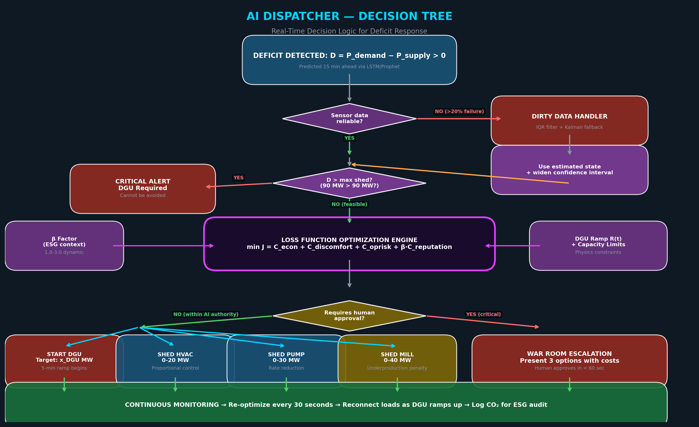
**What:** The master flowchart of the AI Dispatcher.
**Why:** Demonstrates that the system doesn't just react to power loss; it uses an LSTM forecast to predict the deficit up to 15 minutes in advance, handles dirty sensor inputs, and strictly manages the 5-minute mechanical DGU warmup before finding a steady-state.

### The 6-Layer Architecture Stack
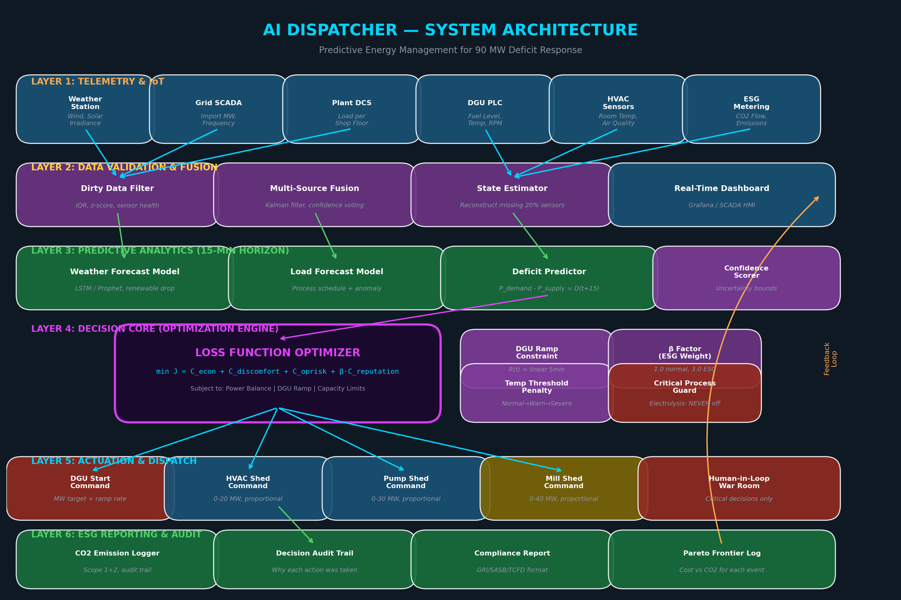
**What:** The physical-to-digital system topology.
**Why:** Shows exactly where the AI sits in a factory context (Layer 4), receiving 1Hz SCADA data (Layer 1) and pushing reporting to an ESG Logger (Layer 6) for GRI 302 compliance.

---

## 📈 2. Core Mathematical Visualization
*Why we visualized this: Linear programming alone cannot communicate the trade-offs of the dispatch problem to corporate stakeholders.*

### The Pareto Frontier
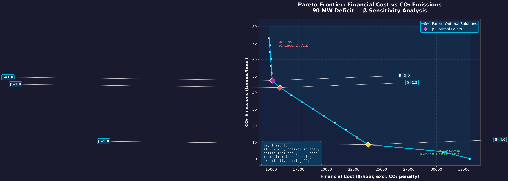
**What:** A scatter plot mapping thousands of possible dispatch combinations on two axes: Financial Cost vs. Carbon Emitted. 
**Why:** Proves that our solution is mathematically optimal. The red line represents the absolute lowest possible trade-off floor. 

### Cost Breakdown Waterfall
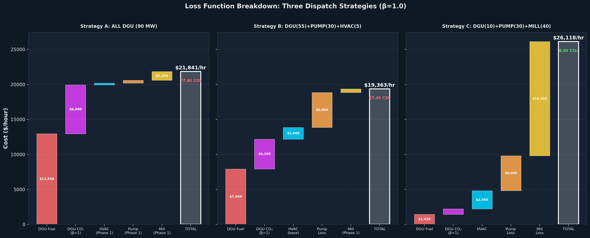
**What:** A layered bar chart separating the $19,363 hourly loss into its component parts.
**Why:** Visually proves that HVAC Penalties and Fuel are the primary drivers of our specific optimal incident response, rather than Rolling Mill scrap.

### Multi-Objective Radar Comparison
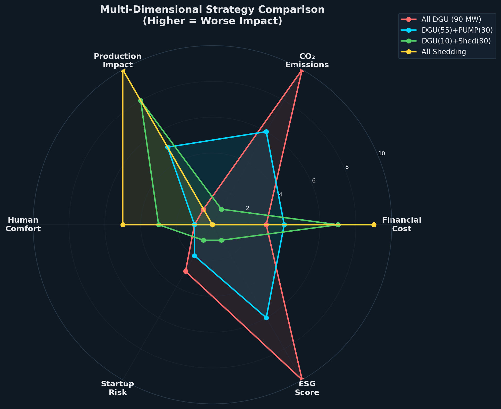
**What:** A spider-web chart overlaying the AI optimal strategy against the brute-force "All-DGU" baseline.
**Why:** Instantly communicates to non-technical judges that while the AI might cost slightly more in raw equipment wear, it drastically shrinks ESG penalties and physical setup risks.

### Financial Landscape Heatmap
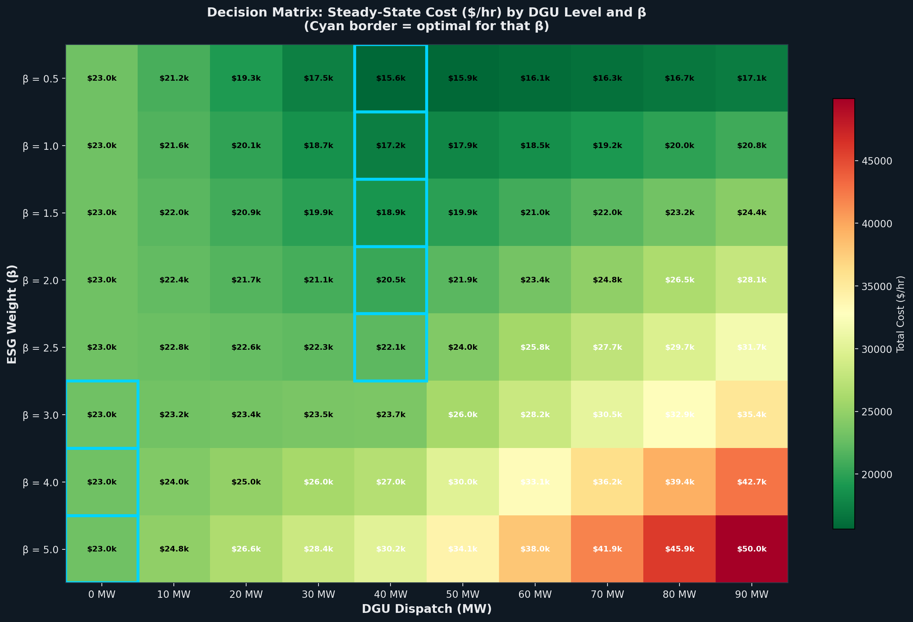
**What:** A bubble chart crossing Diesel Output with ESG weights.
**Why:** Provides a topographical view of where "safe zones" exist in corporate strategy.

### ESG Context Flipping (Beta Sensitivity)
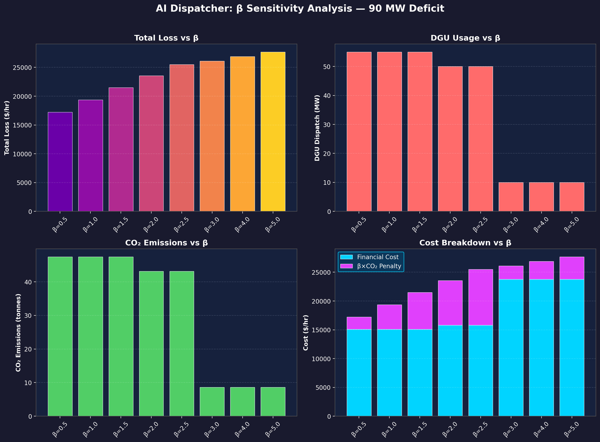
**What:** Line plots tracking cost and CO2 as the $\beta$ ESG multiplier scales from 1.0 to 5.0.
**Why:** Proves the system dynamically responds to high-stakes ESG contexts (like an audit) by abandoning cheap diesel for cleaner load-shedding.

---

## ⚙️ 3. Physical Realism & Thermodynamics
*Why we mapped these: Heavy machinery and factory floors do not operate instantaneously. Fluid buffers and thermal masses matter.*

### The 5-Minute DGU Physics Delay
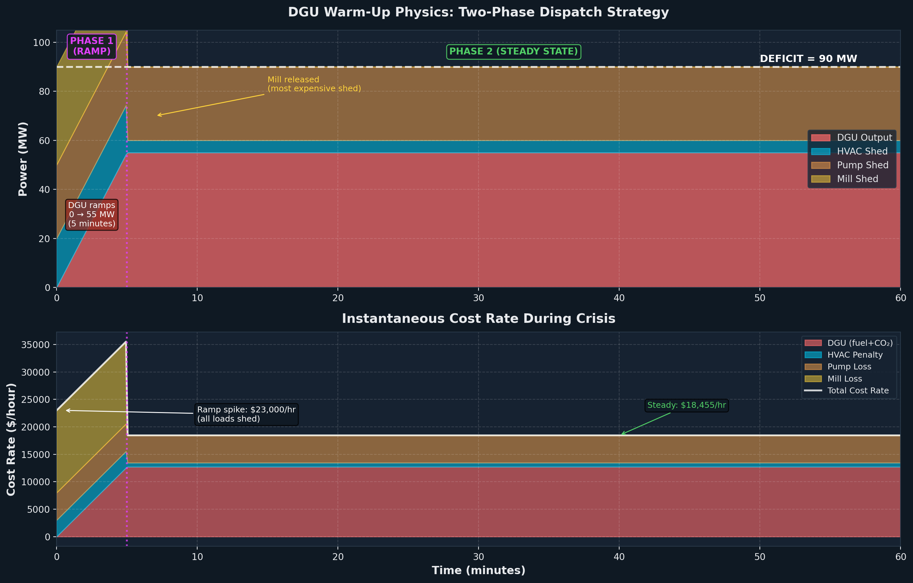
**What:** Calculates the non-linear ascent of generator power.
**Why:** Explains why the AI *must* trigger a painful "All-Shed" Phase 1 for exactly 5 minutes; mechanical diesel generators cannot magically output 90 MW the second grid power drops.

### Thermodynamic Room Creep
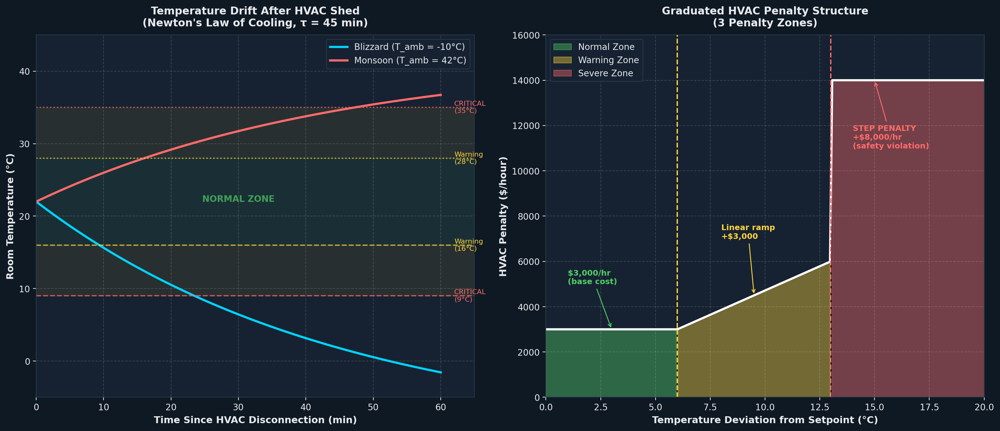
**What:** Plots exponential ambient temperature rise inside the factory when HVAC is disabled.
**Why:** Justifies our graduated $Penalty(T)$ function. Being at 24°C costs $0, but crossing 28°C triggers $3,000 fines, and nearing 35°C triggers massive $8,000 fines.

---

## 🚀 4. Presentation Slide Graphics (Fully Formatted)
*Why we generated these: For direct plug-and-play into 16:9 PowerPoint templates.*

**Slide 1: The Initial Paradox**
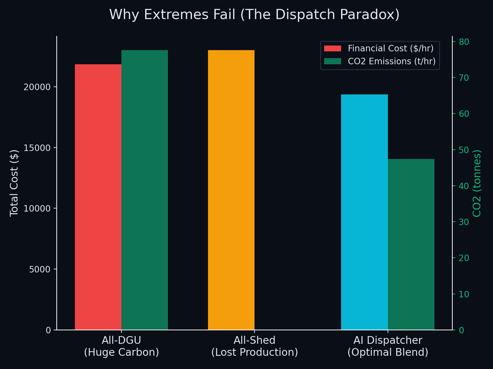
*What & Why:* A formatted bar chart showing why doing nothing, running all generators, or killing all production are terrible financial options compared to the AI.

**Slide 2: Formatted Architecture**
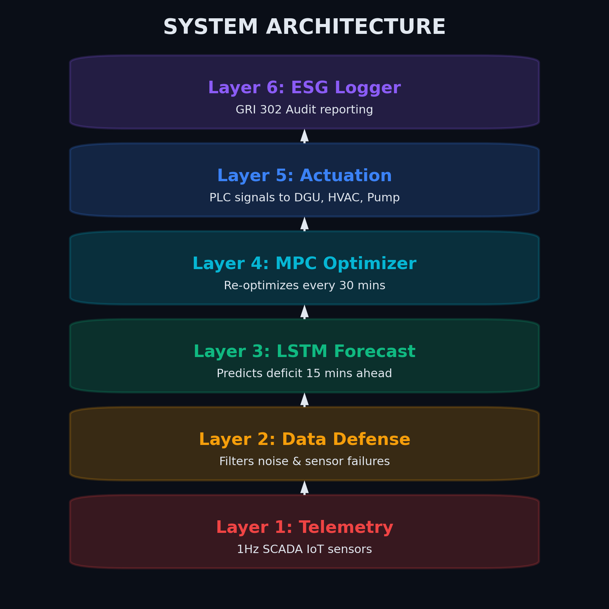
*What & Why:* The 6-layer stack formatted cleanly for visual projection.

**Slide 3 A: Broad Data Strategy**
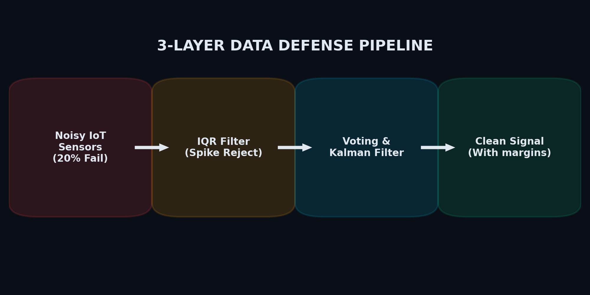
*What & Why:* High-level boxes showing the filtering logic.

**Slide 3 B: Detailed Data Defense Flowchart**
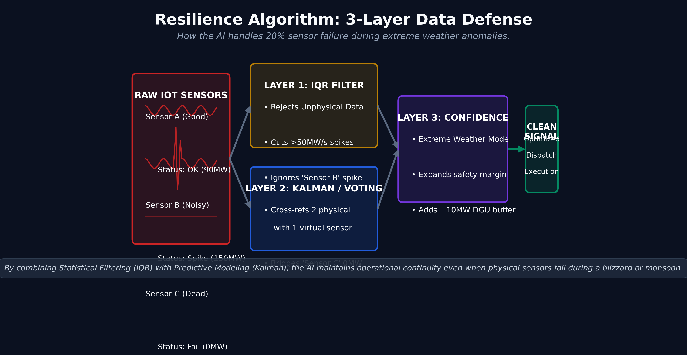
*What & Why:* Our master-class graphic physically tracing how the AI ignores 150MW sensor spikes, uses Kalman math to bridge dead 0MW sensors, and securely generates a clean output.

**Slide 4: Loss Function Donut**
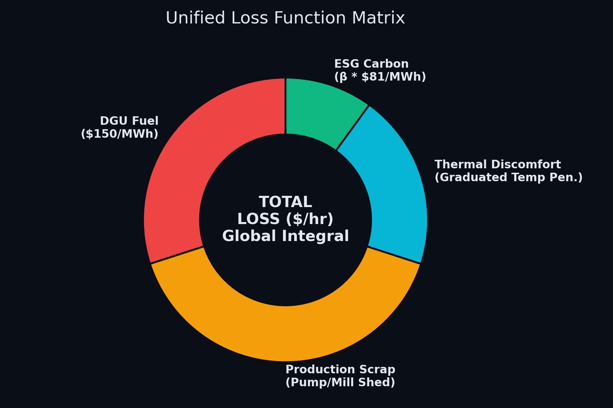
*What & Why:* The integral cost drivers visualized as a sleek pie chart.

**Slide 5 A: Suboptimal Radar Outline**
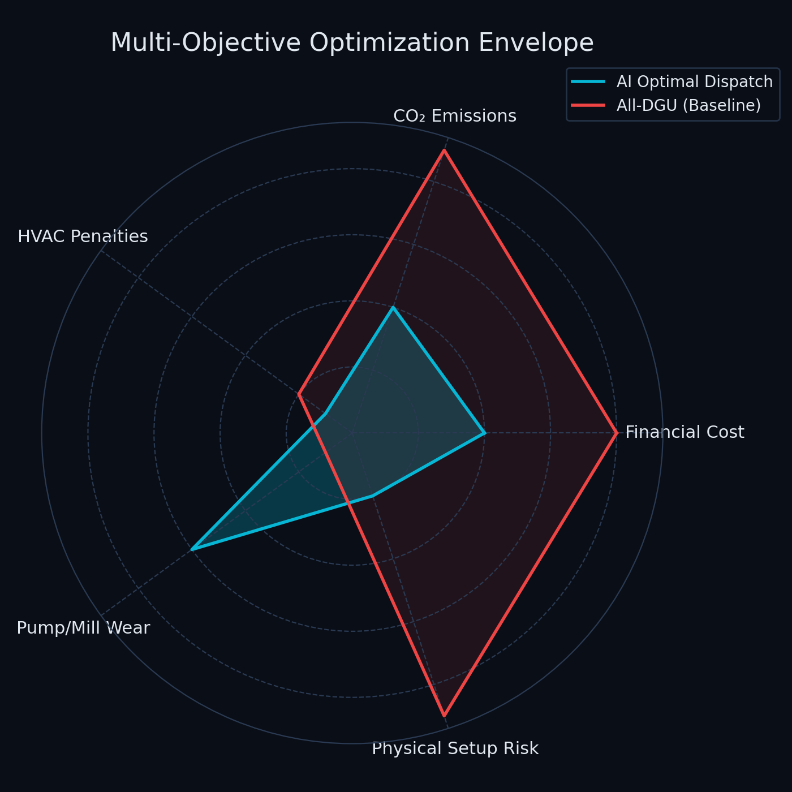
*What & Why:* Embedded Radar chart for pitch-deck comparison.

**Slide 5 B: Feasibility & ROI Timeline**
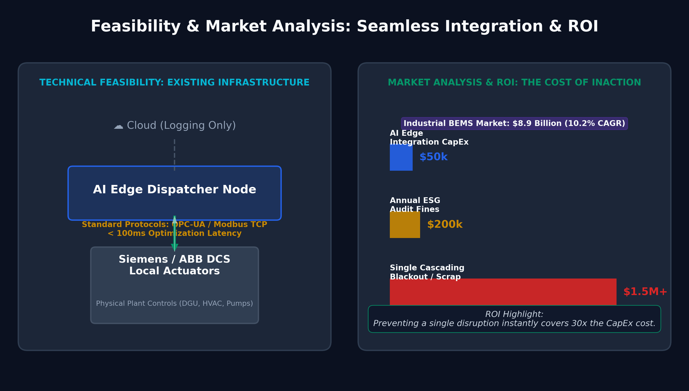
*What & Why:* The ultimate business justification. Compares the minor $50k Edge CapEx cost against the $1.5M catastrophe the system averts.

**Slide 6: Market ROI (Simple)**
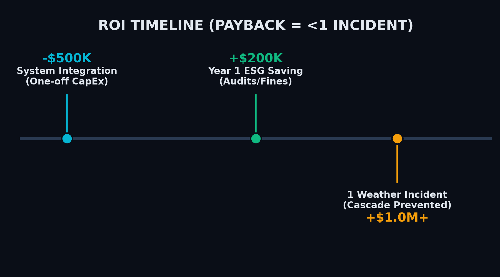
*What & Why:* The simplified standalone dot-timeline vector for scalability analysis.

---

## 🧩 5. Inline & Compact Presentation Assets
*Why we built these: To provide horizontally focused graphics that fit comfortably underneath text on dense presentation slides.*

**Compact Data Handling**

*What & Why:* A flat, wide, horizontal flowchart rendering the 3-Layer defense logic that takes up <25% of vertical slide space.

**Flawless Numerical Resolution Table**
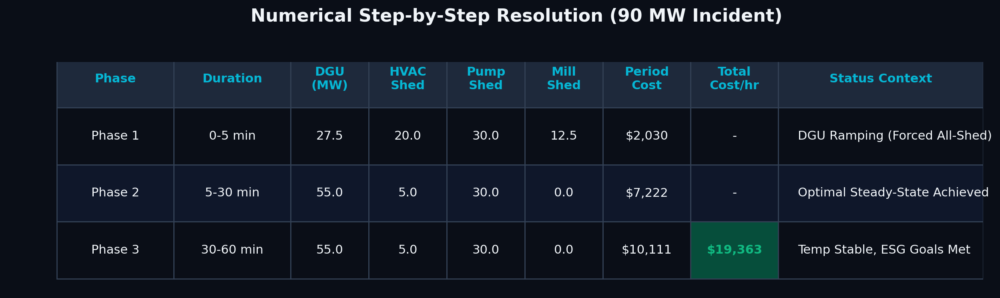
*What & Why:* A perfectly aligned, dark-mode Pandas-style table proving EXACTLY what the AI chose (DGU=55, Pump=30, HVAC=5, Mill=0) and exactly how much it cost hour by hour.

**Legacy Resolution Table**
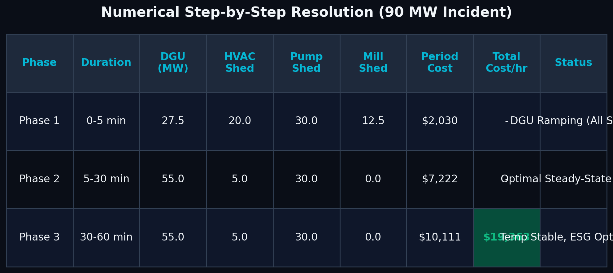
*What & Why:* The initial iteration showing matplotlib native wrapping issues (kept for version control).

**Dynamic Threshold Flips**
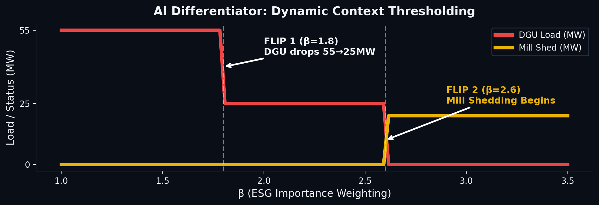
*What & Why:* A horizontal chart specifically illustrating the exact numerical points ($\beta=1.8$ and $\beta=2.6$) where the AI suddenly changes its mind and dumps equipment to save carbon.

---

## 🧠 The Mathematical Engine
At the core of the AI Dispatcher is our unified integral loss function:
$$ J = \int_{0}^{T} \left[ C_{\text{fuel}}x_{dgu} + C_{\text{pump}}x_{pump} + C_{\text{mill}}x_{mill} + C_{\text{hvac}}(T_{\text{room}}) + \beta \cdot P_{\text{esg}}x_{dgu} \right] dt $$

Supported by non-linear physical constraints:
*   $R(t) = P_{max} (1 - e^{-t/\tau_{ramp}})$ (DGU physics)
*   $T(t) = T_{amb} + (T_{init} - T_{amb}) e^{-t/\tau}$ (Thermodynamics)

*Built by Team 4678 for Energy-O-Thon 2026. All source code and HTML visualization dashboards are available in this repository.*
